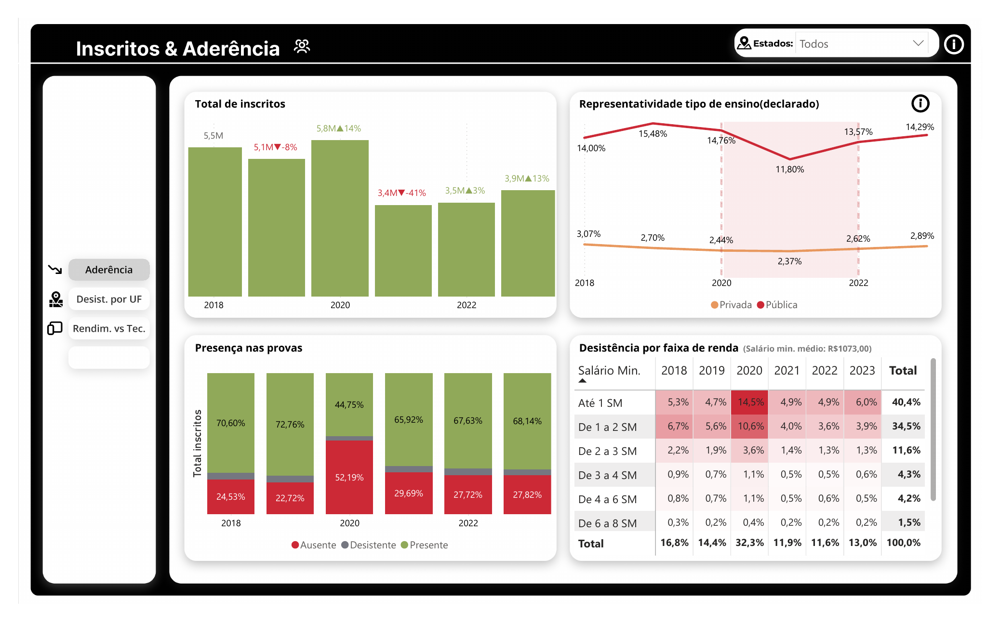

# 📊 Impacto da Pandemia no ENEM (2018–2023)


## 📝 Sobre o Projeto

Este projeto analisa o impacto da pandemia de COVID-19 no desempenho e na participação dos candidatos do ENEM entre 2018 e 2023, cobrindo os anos pré-pandemia, os anos críticos (2020 e 2021) e a retomada pós-pandemia.

O principal desafio técnico foi o volume: a série histórica completa soma mais de **11 GB de arquivos CSV brutos**, inviabilizando análise direta em planilhas ou ferramentas de BI sem tratamento prévio. Para isso, foi desenvolvido um pipeline ETL em Python que reduz os dados para um formato leve e performático, pronto para consumo no Power BI.

---

## ❓ Perguntas que o projeto busca responder

- As inscrições e a presença nas provas caíram durante a pandemia (2020 e 2021)?
- O impacto foi diferente entre escolas públicas e privadas?
- Quais faixas de renda foram mais afetadas pela desistência?
- A desistência variou entre os estados brasileiros?
- Houve recuperação dos indicadores após 2021?

---

## 📸 Prévia do Dashboard

### Inscritos & Aderência



---

## 🔍 Principais Achados

### Queda histórica em 2020
O número de inscritos caiu **41%** em 2020 (de 5,8M para 3,4M), o maior recuo da série histórica do ENEM. A partir de 2021, houve recuperação gradual, atingindo 3,9M em 2023.

### Ausência nas provas triplicou
A taxa de ausência saltou de ~24% (2018–2019) para **52% em 2020** — mais da metade dos inscritos não compareceu às provas no pico da pandemia.

### Impacto desproporcional nas menores rendas
A desistência entre candidatos com renda de até 1 salário mínimo chegou a **14,5% em 2020**, contra 5,3% em 2018. Candidatos de renda mais alta (acima de 4 SM) tiveram variação bem menor (~1,1%), evidenciando um impacto desigual por classe social.

### Escolas públicas: maior queda na representatividade
A representatividade de candidatos de escolas públicas caiu de 15,48% (2019) para 11,80% (2021), com recuperação parcial para 14,29% em 2023. Escolas privadas mantiveram variação bem menor ao longo de todo o período.

---

## 🚀 Pipeline ETL

O notebook `tratamento_microdados.ipynb` executa as seguintes etapas:

**1. Ingestão**
Leitura dos arquivos CSV brutos (separador `;`, encoding `latin1`) ano a ano, de 2018 a 2023.

**2. Amostragem Estratificada**
Coleta de 5% dos registros de cada ano via `sample(frac=0.05, random_state=42)`. O uso de `random_state` fixo garante reprodutibilidade estatística.

**3. Seleção de Features**
Filtragem das colunas relevantes para a análise: dados demográficos, notas por área, tipo de escola, presença nas provas e indicadores socioeconômicos do questionário.

**4. Tratamento de Qualidade (Data Quality)**
- Conversão de tipos (`category`, `int64`, `float32`) para otimização de memória.
- Correção de inconsistência na coluna `TP_ESCOLA` no ano de 2018, onde os códigos diferiam do padrão adotado nos anos seguintes:

  | Código 2018 | Código padrão (2019+) |
  |---|---|
  | 3 | 4 (Escola Pública) |
  | 4 | 3 (Escola Privada) |

**5. Gerenciamento de Memória**
Uso do módulo `gc` para liberar memória após o processamento de cada arquivo, evitando estouro de RAM ao lidar com o volume total.

**6. Exportação em Parquet**
Consolidação de todos os anos em um único arquivo `.parquet`, otimizado para leitura no Power BI.

---

## 📉 Resultado de Performance

| Etapa | Formato | Tamanho |
|---|---|---|
| Dados Brutos (2018–2023) | `.csv` | ~11 GB |
| Dados Tratados | `.parquet` | ~23 MB |

> Redução de ~99,8% no tamanho, mantendo representatividade estatística para análise de tendências.

---

## 🛠️ Tecnologias Utilizadas

| Tecnologia | Uso |
|---|---|
| Python 3.8+ | Linguagem principal |
| Pandas | Manipulação e tratamento de dados |
| PyArrow | Backend para geração do arquivo Parquet |
| GC (Garbage Collector) | Gerenciamento manual de memória |
| Power BI | Visualização e análise (em desenvolvimento) |

---

## ⚙️ Como executar

### Pré-requisitos

```bash
pip install pandas pyarrow
```

### Estrutura esperada de pastas

```
projeto/
├── Dados/
│   └── Microdados/
│       ├── MICRODADOS_ENEM_2018.csv
│       ├── MICRODADOS_ENEM_2019.csv
│       ├── MICRODADOS_ENEM_2020.csv
│       ├── MICRODADOS_ENEM_2021.csv
│       ├── MICRODADOS_ENEM_2022.csv
│       └── MICRODADOS_ENEM_2023.csv
└── tratamento_microdados.ipynb
```

> Os microdados do ENEM são públicos e podem ser baixados no [portal do INEP](https://www.gov.br/inep/pt-br/acesso-a-informacao/dados-abertos/microdados/enem).

### Executando

Abra e execute o notebook `tratamento_microdados.ipynb`. Ao final, o arquivo `amostra_compilada.parquet` será gerado em `./Dados/Microdados/` e pode ser conectado diretamente ao Power BI.

---

## 🗺️ Próximos Passos

- [x] Pipeline ETL completo (ingestão, tratamento, exportação Parquet)
- [x] Dashboard de Inscritos & Aderência
- [x] Análise de desistência por faixa de renda
- [ ] Corrigir visual de mapa (Desistência por UF)
- [ ] Finalizar aba Rendimento vs Tecnologia
- [ ] Publicar dashboard no Power BI Service

---

## 📁 Estrutura do Repositório

```
├── tratamento_microdados.ipynb   # Pipeline ETL completo
├── prints/
│   └── dashboard_aderencia.png   # Preview do dashboard
├── README.md
└── .gitignore
```

---

*Os microdados brutos não estão incluídos no repositório por questões de tamanho. Consulte o portal do INEP para download.*
